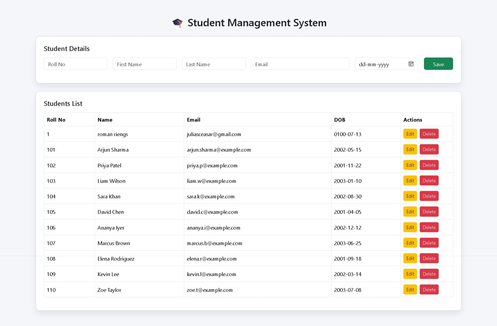

# 🎓 Student Management System

A basic **Student Management System** built with **Spring Boot** to manage student data.  
This application demonstrates core CRUD operations (Create, Read, Update, Delete) on student records using a web interface.

---

## 📸 Screenshots

Below are a couple of screenshots from the running application:

  
*Main dashboard / list view*

  
*Add or view student details*


---

## 🧠 About the Project

This project allows administrators to:

- ➕ **Add new student records**
- 📄 **View existing students**
- ✏️ **Update student information**
- ❌ **Delete student records**

It is ideal as a learning project to understand **Spring Boot**, **MVC architecture**, and basic **database operations**.

---

## 🛠 Tech Stack

| Component | Technology |
|-----------|------------|
| Backend   | Spring Boot (Java) |
| Frontend  | HTML, css / JS |
| Database  | MySQL  |
| Build     | Maven |
| Deployment| Embedded Tomcat (via Spring Boot) |

---

## 🚀 Features

✔️ Add and manage students  
✔️ View all students in a list  
✔️ Edit / update student details  
✔️ Delete students  
✔️ Clean, user‑friendly interface

---

## 📦 Getting Started

### 🔁 Clone the repo

```bash
git clone https://github.com/RISTONRODZ/student-management-system.git
cd student-management-system
